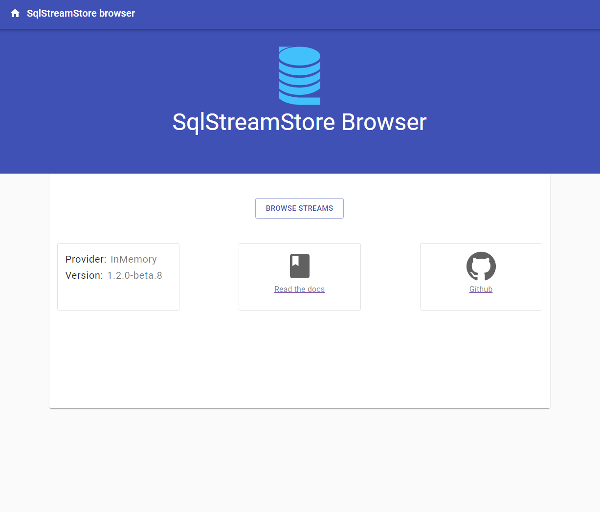
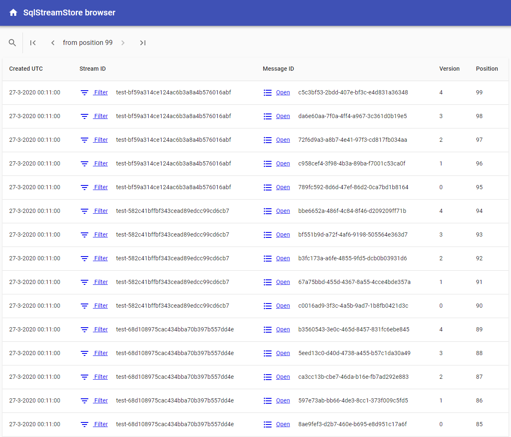

# SqlStreamStore.Browser 

<span>ASP.NET</span> core UI to browse a SqlStreamStore.


## installation

Nuget:

``` shell

dotnet nuget add source https://f.feedz.io/logicality/streamstore-ci/nuget -n streamstore
dotnet package add SqlStreamStore.Browser
```


Startup
``` dotnet

public void Configure(IApplicationBuilder app, IWebHostEnvironment env)
{
    app.UseSqlStreamStoreBrowser();
}

public void ConfigureServices(IServiceCollection services)
{
    services.AddSingleton(streamStoreInstance);
    services.AddSqlStreamStoreBrowser();
}

```

Start your webapp.


## development

Running the development environment you have to start 2 processes:

dotnet core devserver (includes SqlStreamStore.HAL):

``` shell
cd src/SqlStreamStore.Browser.DevServer
dotnet run
```

node webpack devserver (build with [react-create-app](https://reactjs.org/docs/create-a-new-react-app.html#create-react-app)):

``` javascript
cd src/sqlstreamstore.ui
yarn start
```

Enjoy!

## Screens

 
